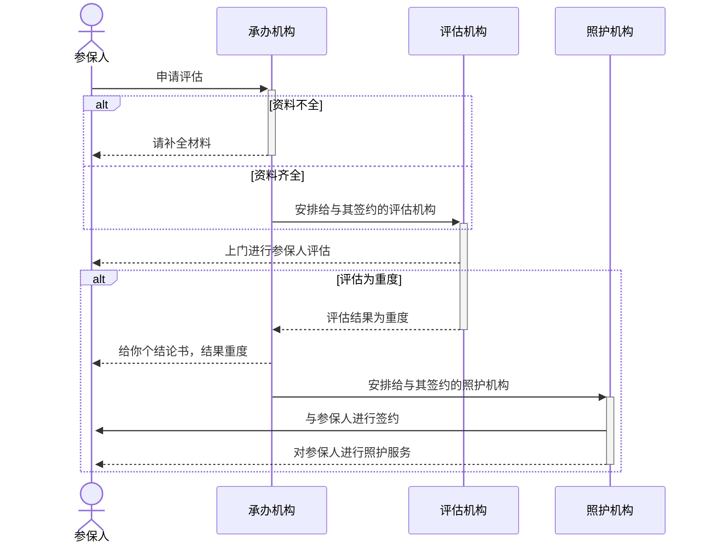
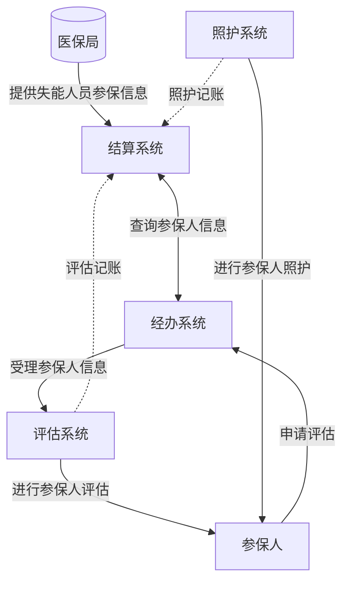

## 目的
为了解决失能人群基本生活，以及获取相关医疗服务，系统提供了一整套评估照护流程，帮助失能人群获取相应的服务
## 业务流程
### 涉及角色
- 参保人
- 承办机构
- 评估机构
- 照护机构

### 涉及终端
- PC端
	- PC经办系统：供承办机构使用，用来受理评估，安排评估，发放通知，安排照护，费用结算
	- PC照护系统：
		- PC评估：供评估机构安排评估计划，费用结算
		- PC照护：供照护机构签约，安排照护计划，费用结算
- APP端
	- APP参保人：供参保人自行申请，跟进状态
	- APP照护人：供照护人上门服务打卡
	- APP评估人：供评估人上门评估问卷
### 具体流程图

## 数据流程
### 数据流程图

## 学习成果
### [[UI自动化测试-Python+Selenium]]